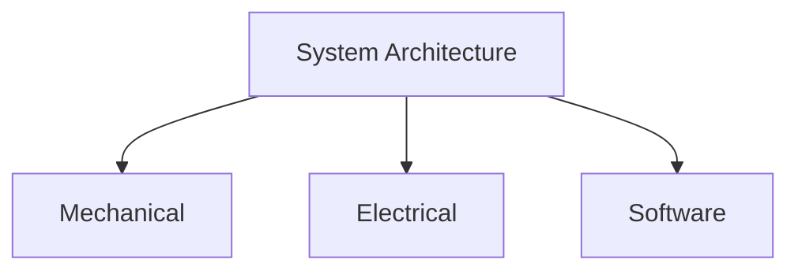
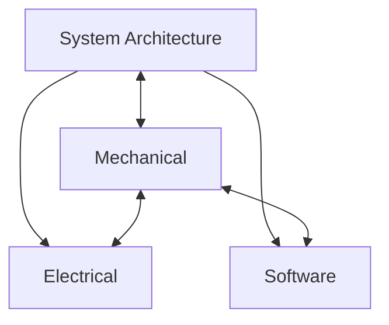
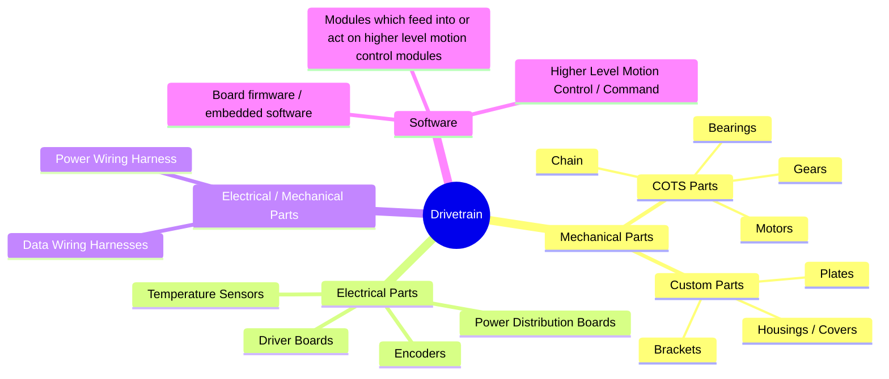
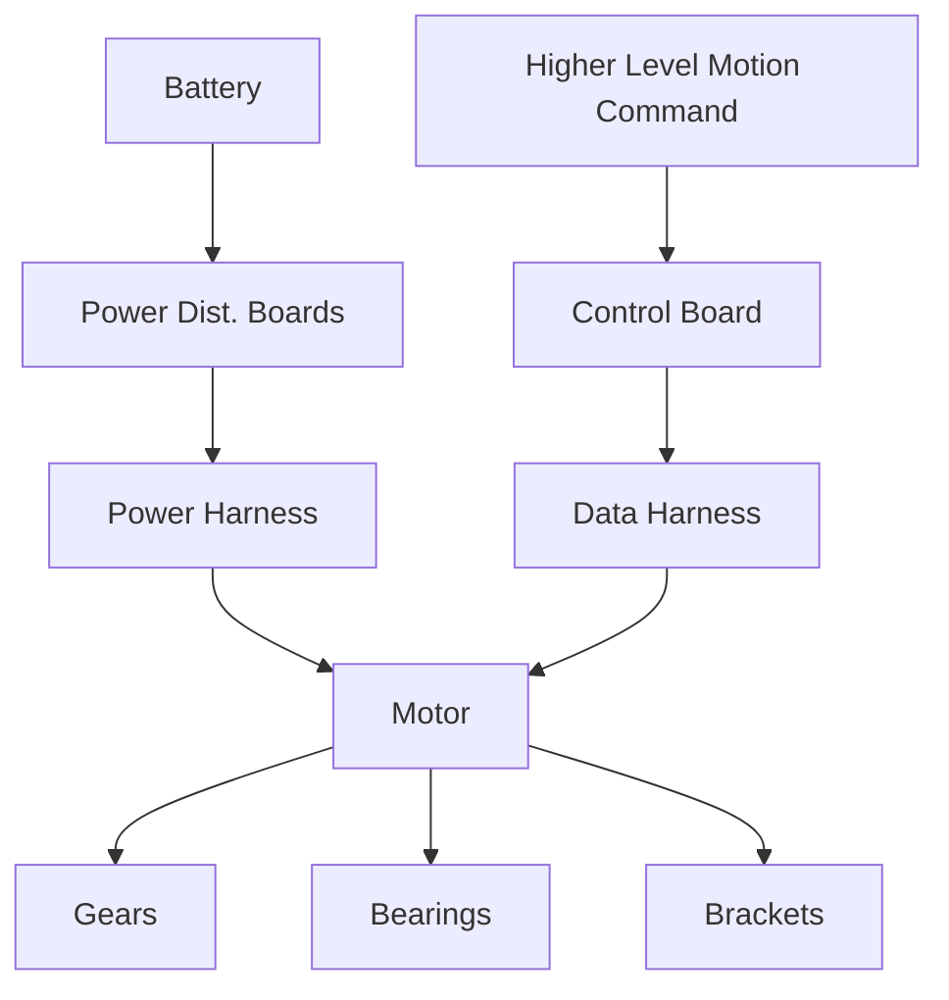

## Systems
Robotics is used in the STEM arena to do a few different things all at once: 
1. Introduce people to various engineering disciplines.
2. Provide a route to experience different aspects of technology by building a physical moving thing.
3. Expose groups to team work dynamics and business fundamentals.
4. Discover manufacturing.
5. Collaborate on multidisciplinary projects that have an n-dimensional solution space. (which lends to N solutions being possible)
6. Make decisions on trade offs in a design and understand how those can impact capability. 

Robotics also allows for exploration of systems of systems concepts. Many products are now not too dissimilar to a robot. Our phones, new medical devices, aviation products, manufacturing equipment, etc are increasingly adopting semi automated workflows, and contain various sensors (cameras, inertial measurement units, encoders, etc) in their bill of materials. Frequently robotics is shown as a neat diagram of sorts seen in Figure 1 below. Teams can be often organized roughly in this manner too. However, its not a good idea to do this rigidly. 

  <strong>Figure 1. Chart Showing Idealized Organization of Robotics</strong>

 

Often times in robotics and complex systems, during various development loops there can be cross linking among the pillars. Many subsystems in fact are composed of a combination of the three pillars. These subsystems can be driving design considerations of other systems. During the development if we look at cross linking from the mechanical pillar we can see the chart can start to look like Figure 2. 

  <strong>Figure 2. Chart Showing Robotics Interlinks That Come Up</strong>

 

Understanding how to identify and then overcome subsystem design dependency is a learned skill that requires the context of stem disciplines. Often times the drive train can occupy the mechanical column of robotics. It can also often drive a good bit of layout and packaging constraints for the platform. It also has a fair bit of very visible mechanical parts which can have multiple constraints that come from the physical mechanical world. Lets look at a theoretical map of a drivetrain sub system. 

  <strong>Figure 3. A Theoretical Map of a Drivetrain Subsystem</strong>

 

We can see a decent collection of chunks from all the pillars represented in this map. A proper team (or subteam) for this subsystem would then be composed of personnel from each column. Since it has so much mechanical weight to it the lead for this subteam might be best a person from the mechanical column who helps facilitate coordination across disciplines. Lets dive a bit further into motors. They are good way to continue this systems and multidisciplinary case study as many constraints meet within them and they can many knock on effects driving sizing for other subsystems. 

  <strong>Figure 4. Chart Showing How a Motor Might be Linked to Components from Figure 3.</strong>

 

Motors have multiple layer of input and output in Figure 4. Changing them can cause impacts in multiple layers of the design and their selection trade off space can represent a meaningful segment of the n-dimensional design space. They have impacts on battery sizing, mechanical parts selection, parts design, and software settings. 
